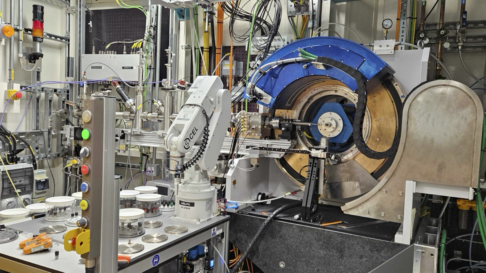
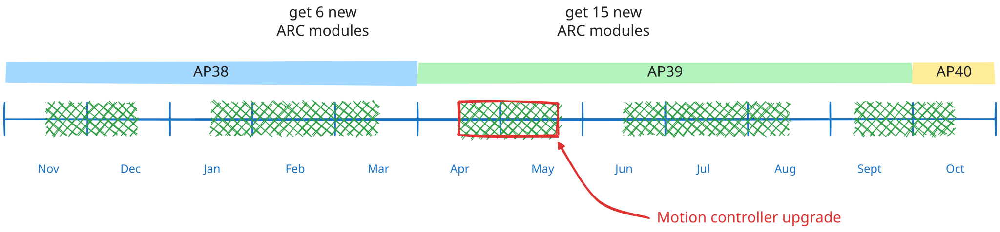
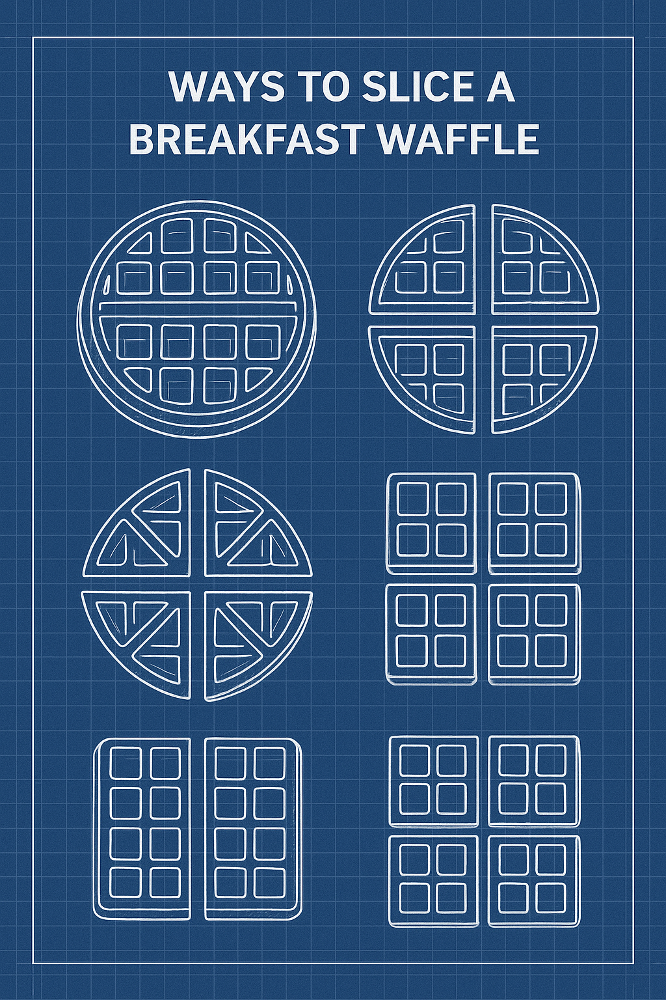

# How do you slice a waffle?
Dean Keeble
20th October 2025

---

## Contents

- a quick introduction to how i15-1 operates
- beamline schedule for next 12 months
- what project waffle _hoped_ to achieve
- establish a shortlist of well-defined functional statements

---

## A quick intro to I15-1

We specialise in _total scattering_ which most people inspect via the _pair distribution function_

---
Our detector is a Perkin Elmer (sometimes called a Varex) which operates on a fixed clock: it reads out every 3 seconds

* we have a new detector though :smiley: 
* we don't use it because the data it produces isn't good enough :frowning_face:

---
## Types of experiment

roughly half of proposals study sample _ex situ_; we use a robot sample changer
some of those we run as mail-in

---

---

## what is... _was_... project waffle?

---

# Waffle &nbsp; &nbsp;&nbsp;&nbsp;&nbsp;&nbsp;&nbsp;&nbsp;&nbsp;&nbsp;&nbsp;&nbsp;&nbsp;&nbsp;&nbsp;&nbsp;&nbsp;&nbsp;&nbsp;&nbsp;&nbsp;&nbsp;&nbsp;&nbsp;&nbsp;

[ **wof**-uhl ]
**noun**
*In user interface design, "waffle" refers to a grid-like menu or app launcher, often used as a navigation element, resembling a waffle's squares.*

---

Project waffle <del>seeks</del> _sought_ to bring together new software components to make a fully integrated system on an existing Diamond beamline (I15-1). 

---

## beamline objectives
A measurement takes 10 minutes of beamtime, and an hour of staff-time
* collecting sample information
* distributing consumables
* making experiment plan
* processing data
* notifying users

